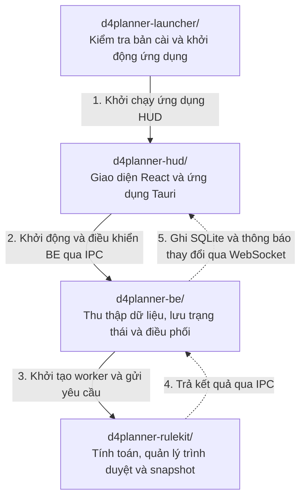

```mermaid
flowchart TD
    LAUNCHER["d4planner-launcher/<br/>Kiểm tra bản cài và khởi động ứng dụng"]
    HUD["d4planner-hud/<br/>Giao diện React và ứng dụng Tauri"]
    BE["d4planner-be/<br/>Thu thập dữ liệu, lưu trạng thái và điều phối"]
    RULEKIT["d4planner-rulekit/<br/>Tính toán, quản lý trình duyệt và snapshot"]

    LAUNCHER -->|"1. Khởi chạy ứng dụng HUD"| HUD
    HUD -->|"2. Khởi động và điều khiển BE qua IPC"| BE
    BE -->|"3. Khởi tạo worker và gửi yêu cầu"| RULEKIT
    RULEKIT -.->|"4. Trả kết quả qua IPC"| BE
    BE -.->|"5. Ghi SQLite và thông báo thay đổi qua WebSocket"| HUD
```
