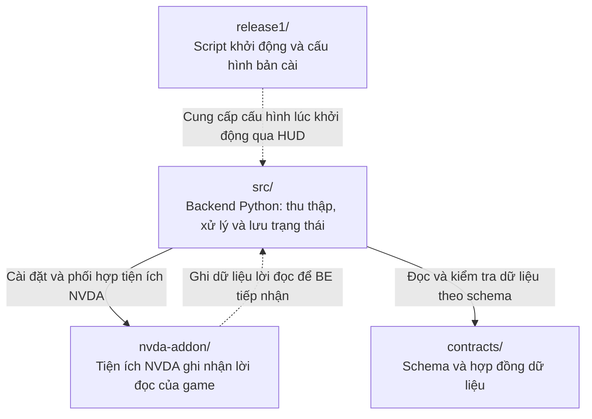

```mermaid
flowchart TD
    CORE["src/<br/>Backend Python: thu thập, xử lý và lưu trạng thái"]
    NVDA["nvda-addon/<br/>Tiện ích NVDA ghi nhận lời đọc của game"]
    CONTRACTS["contracts/<br/>Schema và hợp đồng dữ liệu"]
    RELEASE["release1/<br/>Script khởi động và cấu hình bản cài"]

    CORE -->|"Cài đặt và phối hợp tiện ích NVDA"| NVDA
    NVDA -.->|"Ghi dữ liệu lời đọc để BE tiếp nhận"| CORE
    CORE -->|"Đọc và kiểm tra dữ liệu theo schema"| CONTRACTS
    RELEASE -.->|"Cung cấp cấu hình lúc khởi động qua HUD"| CORE
```
