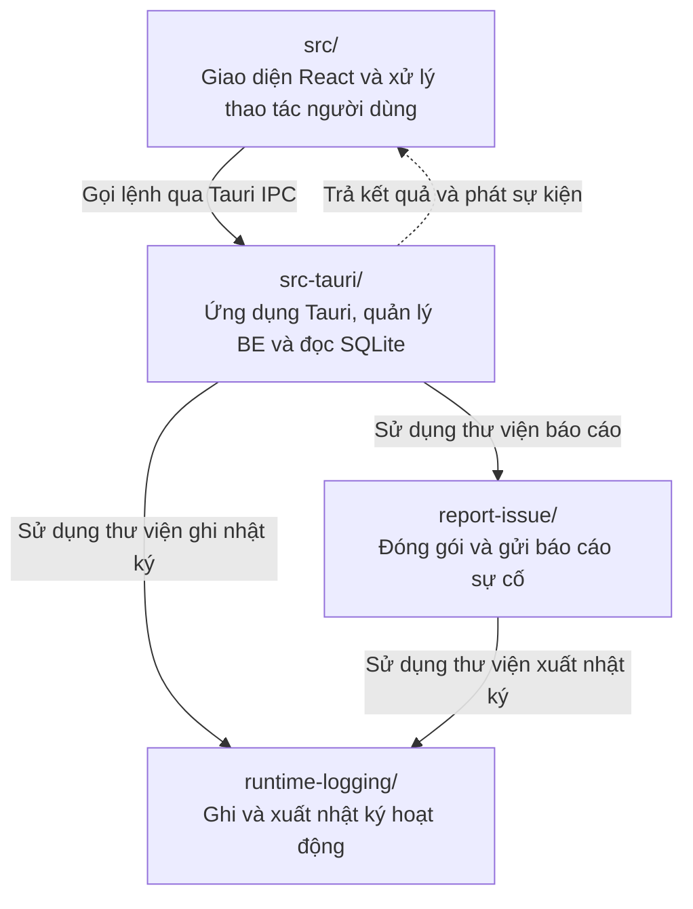

```mermaid
flowchart TD
    UI["src/<br/>Giao diện React và xử lý thao tác người dùng"]
    NATIVE["src-tauri/<br/>Ứng dụng Tauri, quản lý BE và đọc SQLite"]
    REPORT["report-issue/<br/>Đóng gói và gửi báo cáo sự cố"]
    LOG["runtime-logging/<br/>Ghi và xuất nhật ký hoạt động"]

    UI -->|"Gọi lệnh qua Tauri IPC"| NATIVE
    NATIVE -.->|"Trả kết quả và phát sự kiện"| UI
    NATIVE -->|"Sử dụng thư viện báo cáo"| REPORT
    NATIVE -->|"Sử dụng thư viện ghi nhật ký"| LOG
    REPORT -->|"Sử dụng thư viện xuất nhật ký"| LOG
```
