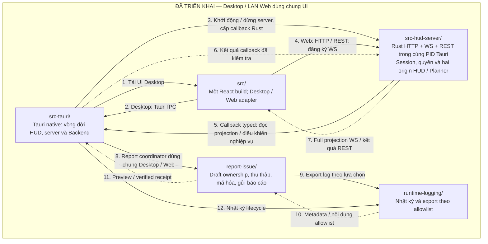

```mermaid
flowchart TD
    subgraph IMPLEMENTED["ĐÃ TRIỂN KHAI — Desktop / LAN Web dùng chung UI"]
        NATIVE["src-tauri/<br/>Tauri native: vòng đời HUD, server và Backend"]
        UI["src/<br/>Một React build; Desktop / Web adapter"]
        SERVER["src-hud-server/<br/>Rust HTTP + WS + REST trong cùng PID Tauri<br/>Session, quyền và hai origin HUD / Planner"]
        REPORT["report-issue/<br/>Draft ownership, thu thập, mã hóa, gửi báo cáo"]
        LOG["runtime-logging/<br/>Nhật ký và export theo allowlist"]
    end
    NATIVE -->|"1. Tải UI Desktop"| UI
    UI -->|"2. Desktop: Tauri IPC"| NATIVE
    NATIVE -->|"3. Khởi động / dừng server, cấp callback Rust"| SERVER
    UI -->|"4. Web: HTTP / REST; đăng ký WS"| SERVER
    SERVER -->|"5. Callback typed: đọc projection / điều khiển nghiệp vụ"| NATIVE
    NATIVE -.->|"6. Kết quả callback đã kiểm tra"| SERVER
    SERVER -.->|"7. Full projection WS / kết quả REST"| UI
    NATIVE -->|"8. Report coordinator dùng chung Desktop / Web"| REPORT
    REPORT -->|"9. Export log theo lựa chọn"| LOG
    LOG -.->|"10. Metadata / nội dung allowlist"| REPORT
    REPORT -.->|"11. Preview / verified receipt"| NATIVE
    NATIVE -->|"12. Nhật ký lifecycle"| LOG
```
