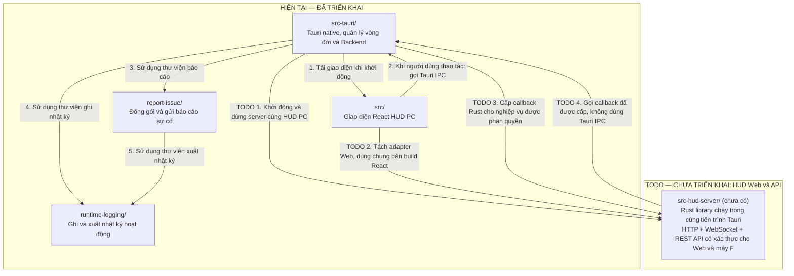

```mermaid
flowchart TD
    subgraph HIEN_TAI["HIỆN TẠI — ĐÃ TRIỂN KHAI"]
        NATIVE["src-tauri/<br/>Tauri native, quản lý vòng đời và Backend"]
        UI["src/<br/>Giao diện React HUD PC"]
        REPORT["report-issue/<br/>Đóng gói và gửi báo cáo sự cố"]
        LOG["runtime-logging/<br/>Ghi và xuất nhật ký hoạt động"]
    end

    NATIVE -->|"1. Tải giao diện khi khởi động"| UI
    UI -->|"2. Khi người dùng thao tác: gọi Tauri IPC"| NATIVE
    NATIVE -->|"3. Sử dụng thư viện báo cáo"| REPORT
    NATIVE -->|"4. Sử dụng thư viện ghi nhật ký"| LOG
    REPORT -->|"5. Sử dụng thư viện xuất nhật ký"| LOG

    subgraph TODO_HUD_WEB["TODO — CHƯA TRIỂN KHAI: HUD Web và API"]
        SERVER["src-hud-server/ (chưa có)<br/>Rust library chạy trong cùng tiến trình Tauri<br/>HTTP + WebSocket + REST API có xác thực cho Web và máy F"]
    end

    NATIVE -->|"TODO 1. Khởi động và dừng server cùng HUD PC"| SERVER
    UI -->|"TODO 2. Tách adapter Web, dùng chung bản build React"| SERVER
    NATIVE -->|"TODO 3. Cấp callback Rust cho nghiệp vụ được phân quyền"| SERVER
    SERVER -->|"TODO 4. Gọi callback đã được cấp, không dùng Tauri IPC"| NATIVE
```
