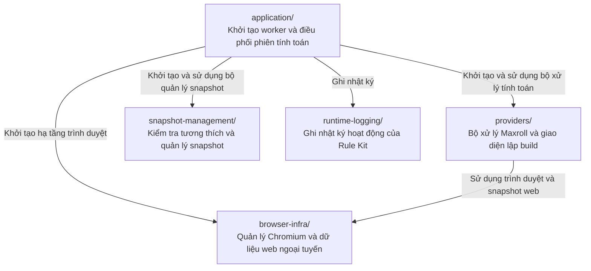

```mermaid
flowchart TD
    APP["application/<br/>Khởi tạo worker và điều phối phiên tính toán"]
    PROVIDERS["providers/<br/>Bộ xử lý Maxroll và giao diện lập build"]
    BROWSER["browser-infra/<br/>Quản lý Chromium và dữ liệu web ngoại tuyến"]
    SNAPSHOT["snapshot-management/<br/>Kiểm tra tương thích và quản lý snapshot"]
    LOG["runtime-logging/<br/>Ghi nhật ký hoạt động của Rule Kit"]

    APP -->|"Khởi tạo và sử dụng bộ quản lý snapshot"| SNAPSHOT
    APP -->|"Khởi tạo và sử dụng bộ xử lý tính toán"| PROVIDERS
    APP -->|"Khởi tạo hạ tầng trình duyệt"| BROWSER
    PROVIDERS -->|"Sử dụng trình duyệt và snapshot web"| BROWSER
    APP -->|"Ghi nhật ký"| LOG
```
